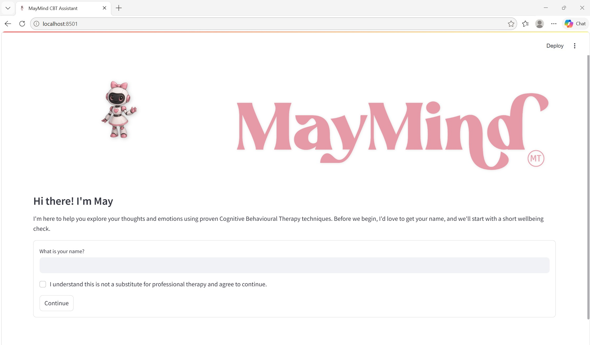
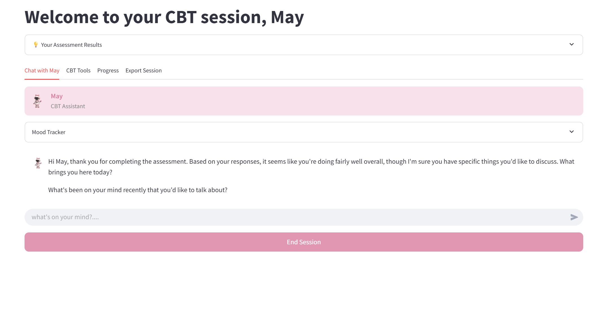

# MayMind — AI-Powered CBT Assistant

> *"Bridging the gap in global access to mental health support."*

MayMind is an AI-powered Cognitive Behavioural Therapy (CBT) chatbot designed as an initial prototype for the future of AI in mental health. Built with the belief that quality mental health support should be accessible to everyone, regardless of location or financial means, MayMind provides evidence-based CBT techniques through a warm, conversational AI therapist named May.

> **Disclaimer:** MayMind is an AI assistant and prototype, not a licensed therapist or medical device. For clinical mental health support, please consult a qualified professional.

---

## The Problem

Millions of people worldwide struggle with anxiety, depression, and other mental health challenges but face significant barriers to accessing support — high costs, long waiting lists, geographic limitations, and social stigma. MayMind is a step toward breaking down those barriers, making CBT-based support available to anyone, anywhere, at any time.

---

## Screenshots

### Welcome Screen


### Main Interface — CBT Tools


> To add your own screenshots, save them to `assets/screenshots/` and update the paths above.

---

## How It Works

MayMind combines a conversational AI with structured CBT frameworks:

1. **Onboarding** — The user enters their name and completes a brief consent step
2. **Assessment** — Validated PHQ-9 (depression) and GAD-7 (anxiety) screening questionnaires establish a baseline
3. **Personalised Chat** — May, the AI therapist, receives the user's assessment scores, mood data, and recent journal entries as context, allowing her to tailor every response
4. **CBT Techniques** — The underlying prompt is grounded in the UK NHS/IAPT CBT framework, guiding May to validate emotions, gently reframe negative thoughts, and encourage behavioural activation
5. **Tools** — Alongside the chat, users can work through structured CBT exercises independently
6. **Session Export** — At the end of a session, users can download a full PDF report or chat transcript for personal records or to share with a professional

The AI uses OpenAI's GPT model with a carefully engineered system prompt that enforces therapeutic structure, avoids generic responses, and keeps conversation grounded in the user's specific situation.

---

## Features

- **CBT Chat with May** — Personalised, context-aware therapeutic conversation
- **PHQ-9 & GAD-7 Assessments** — Clinically validated mental health screening at session start
- **Mood Tracker** — Log and visualise mood trends over time
- **Thought Journal** — Record situations, emotions, and automatic thoughts; identify cognitive distortions; develop balanced alternatives
- **Activity Planner** — Schedule and track behavioural activation activities
- **Breathing Exercises** — Guided 4-4-6 breathing technique for anxiety and stress relief
- **Progress Dashboard** — Visual charts of mood trends, activity completion, and journal insights
- **PDF Export** — Download full session reports or chat transcripts
- **Crisis Safety Net** — Detects crisis keywords and immediately displays UK emergency mental health resources

---

## Tech Stack

| Layer | Technology |
|---|---|
| Frontend / UI | [Streamlit](https://streamlit.io) |
| AI / NLP | [OpenAI API](https://platform.openai.com) (GPT) |
| Data | Python session state, Pandas |
| Visualisation | Matplotlib |
| PDF Generation | FPDF |
| Environment | Python 3.11, python-dotenv |

---

## Setup

### 1. Clone the repository

```bash
git clone https://github.com/may2003/MayMind-CBT-Chatbot.git
cd MayMind-CBT-Chatbot
```

### 2. Create a virtual environment

```bash
python -m venv venv
source venv/bin/activate        # macOS/Linux
venv\Scripts\activate           # Windows
```

### 3. Install dependencies

```bash
pip install -r requirements.txt
```

### 4. Configure your API key

```bash
cp .env.example .env
```

Edit `.env` and add your OpenAI API key:

```
OPENAI_API_KEY=your_openai_api_key_here
```

### 5. Run the app

```bash
streamlit run app.py
```

---

## Project Structure

```
MayMind-CBT-Chatbot/
├── app.py                    # Main Streamlit application
├── ai/
│   └── therapist.py          # OpenAI integration and CBT prompt engineering
├── helpers/
│   ├── assessment.py         # PHQ-9 and GAD-7 assessments
│   ├── safety.py             # Crisis detection and emergency resources
│   ├── ui.py                 # Shared UI components
│   └── utils.py              # Session state initialisation
├── tools/
│   ├── thought_journal.py    # CBT thought record tool
│   ├── activity_scheduler.py # Behavioural activation planner
│   ├── breathing.py          # Guided breathing exercise
│   └── mood_tracker.py       # Mood logging
├── export/
│   ├── pdf_generator.py      # Full session PDF report
│   └── transcript.py         # Chat transcript PDF
├── styles/
│   └── maymind.css           # Custom pink theme
├── assets/                   # Images and icons
├── tests/                    # Unit, integration, whitebox, blackbox, live API tests
├── .env.example              # Environment variable template
└── requirements.txt
```

---

## Crisis Support

If you or someone you know is in crisis, please contact:

| Service | Contact |
|---|---|
| Samaritans | 116 123 (Free, 24/7) |
| Crisis Text Line | Text SHOUT to 85258 |
| Emergency Services | 999 |
| NHS Direct | 111 |

---

## License

Copyright (c) 2026. All Rights Reserved. See [LICENSE](LICENSE) for details.
